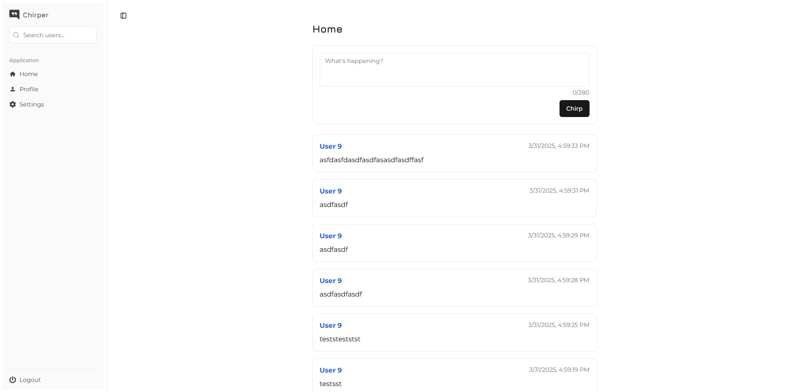
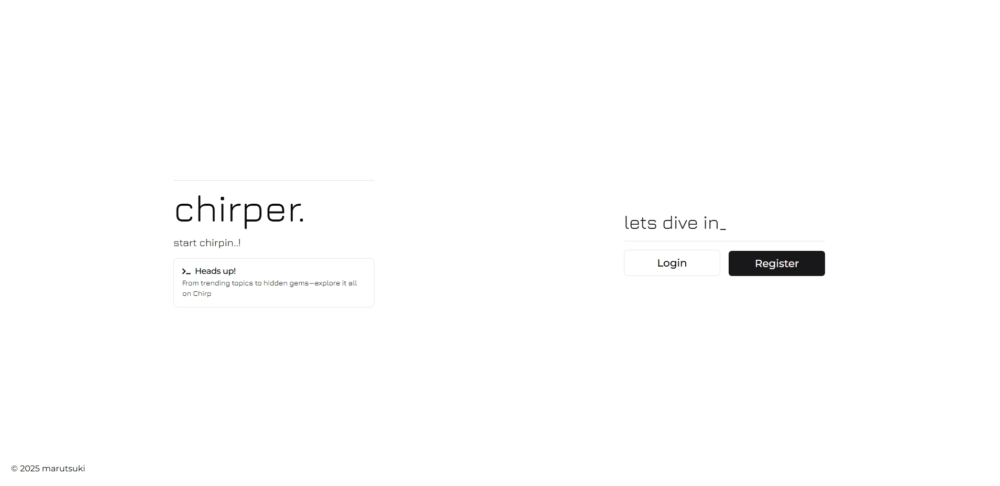
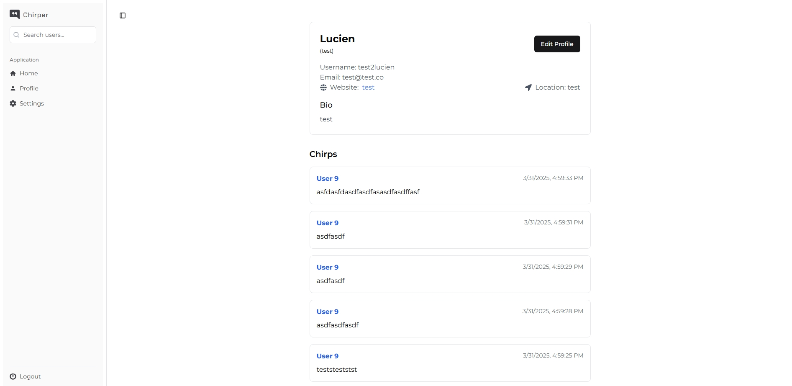
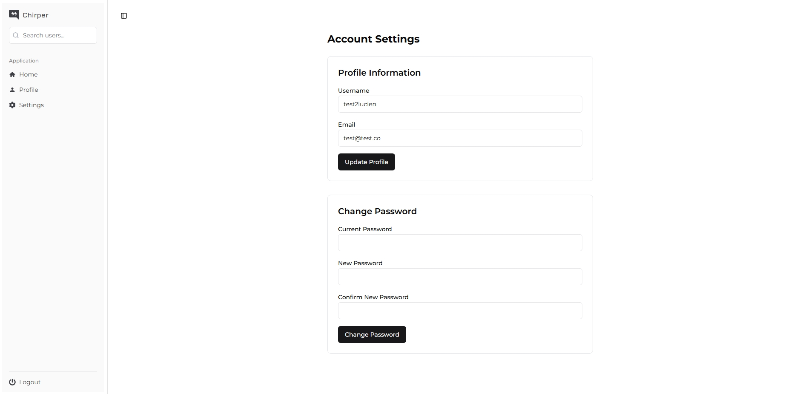

# Chirper

Chirper is a modern social media platform inspired by Twitter, allowing users to share short messages (chirps), follow other users, and engage with a personalized timeline.



## Features

- **User Authentication**: Secure registration and login system
- **Create Chirps**: Post short messages to share with followers
- **User Profiles**: Customizable user profiles with profile information
- **Follow System**: Follow/unfollow other users to customize your feed
- **Timeline**: View chirps from users you follow in a chronological feed
- **Responsive Design**: Fully responsive UI that works on desktop and mobile devices
- **Pagination**: Efficient cursor-based pagination for loading chirps

## Screenshots

<div align="center">
  
  
</div>

<div align="center">
  
  
</div>

## Technology Stack

### Backend
- **Node.js** with **Express**
- **TypeScript**
- **PostgreSQL**
- **Knex.js**
- **Passport.js**
- **JWT**
- **Pino**

### Frontend
- **React 19**
- **TypeScript**
- **React Router**
- **Tailwind CSS**
- **Radix UI/ShadCN**
- **React Hook Form**
- **Vite**

## Getting Started

### Prerequisites
- Node.js (v18 or higher)
- npm or yarn
- Docker and Docker Compose (for PostgreSQL database)

### Installation

1. Clone the repository
   ```bash
   git clone https://github.com/yourusername/chirper.git
   cd chirper
   ```

2. Create a `.env` file in the root directory with the following variables:
   ```
   # PostgreSQL Configuration
   POSTGRES_USER=postgres
   POSTGRESDB_PASSWORD=your_password
   POSTGRESDB_DATABASE=chirper
   POSTGRESDB_LOCAL_PORT=5432
   POSTGRESDB_DOCKER_PORT=5432
   
   # JWT Configuration
   JWT_SECRET=your_jwt_secret
   ```

3. Start the PostgreSQL database
   ```bash
   docker-compose up -d
   ```

4. Install dependencies
   ```bash
   npm install
   ```

5. Run database migrations
   ```bash
   cd chirper-backend
   npm run migrate:up
   ```

6. Seed the database (optional)
   ```bash
   npm run seed
   ```

7. Start the backend server
   ```bash
   npm run dev
   ```

8. In a new terminal, start the frontend development server
   ```bash
   cd ../chirper-web
   npm run dev
   ```

9. Open your browser and navigate to `http://localhost:5173`

## Project Structure

```
chirper/
├── chirper-backend/           # Backend Node.js application
│   ├── migrations/            # Database migrations
│   ├── seeds/                 # Database seed data
│   └── src/
│       ├── config/            # Configuration files
│       ├── controller/        # Route controllers
│       ├── middleware/        # Express middleware
│       ├── model/             # Data models
│       └── service/           # Business logic
├── chirper-web/               # Frontend React application
│   ├── public/                # Static assets
│   └── src/
│       ├── app/               # Application core
│       ├── components/        # Reusable UI components
│       ├── hooks/             # Custom React hooks
│       └── lib/               # Utility functions
└── docker-compose.yaml        # Docker configuration
```

## API Endpoints

### Authentication
- `POST /api/auth/register` - Register a new user
- `POST /api/auth/login` - Login and get JWT token
- `GET /api/auth/me` - Get current user information

### Chirps
- `GET /api/chirps` - Get all chirps
- `GET /api/chirps/:id` - Get a specific chirp
- `GET /api/chirps/user/:id` - Get chirps from a specific user
- `POST /api/chirps` - Create a new chirp
- `PUT /api/chirps/:id` - Update a chirp
- `DELETE /api/chirps/:id` - Delete a chirp

### Timeline
- `GET /api/timeline` - Get the current user's timeline (chirps from followed users)

### Users
- `GET /api/users/:id` - Get user information
- `PUT /api/users/:id` - Update user information

### Follows
- `POST /api/follows/follow/:id` - Follow a user
- `POST /api/follows/unfollow/:id` - Unfollow a user
- `GET /api/follows/check/:id` - Check if current user follows a specific user
- `GET /api/follows/followers/:id` - Get followers of a user
- `GET /api/follows/following/:id` - Get users that a specific user follows

## Contributing

1. Fork the repository
2. Create your feature branch (`git checkout -b feature/amazing-feature`)
3. Commit your changes (`git commit -m 'Add some amazing feature'`)
4. Push to the branch (`git push origin feature/amazing-feature`)
5. Open a Pull Request

## License

This project is licensed under the MIT License - see the [LICENSE](LICENSE) file for details.
