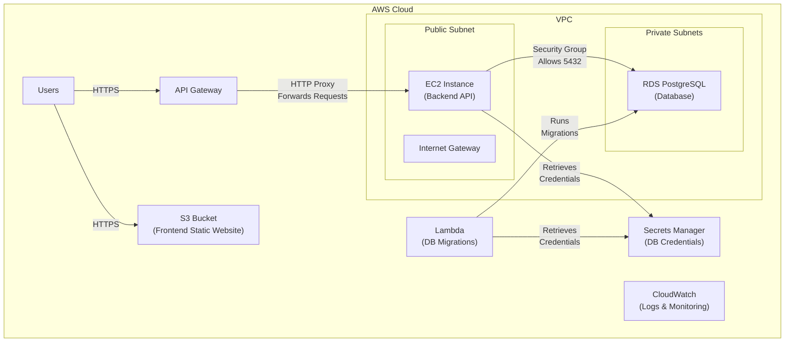
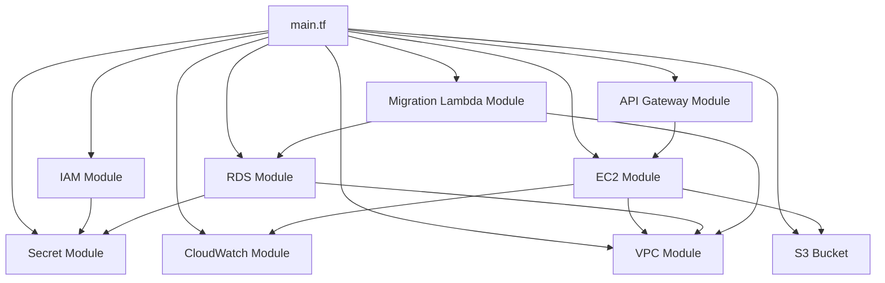

# Chirper Infrastructure

This directory contains the Terraform configuration for deploying the Chirper application infrastructure on AWS.

## Architecture Overview

The Chirper application is deployed on AWS with the following architecture:



## Infrastructure Components

### Backend Infrastructure

- **VPC**: Network isolation with public and private subnets
  - Public subnet for EC2 instance
  - Private subnets for RDS database
  - Security groups for controlling access

- **EC2 Instance**: Hosts the Express.js backend application
  - Deployed in the public subnet
  - Security group allows inbound traffic on port 3000 from API Gateway
  - Connects to RDS database in private subnet

- **RDS**: PostgreSQL database
  - Deployed in private subnets
  - Security group allows inbound traffic on port 5432 from EC2 instance

- **API Gateway**: Routes requests to the EC2 instance
  - HTTP API with proxy integration
  - CORS configuration
  - Forwards all paths to the EC2 instance

- **Secrets Manager**: Securely stores database credentials
  - Used by EC2 instance and Lambda function

- **CloudWatch**: Logging and monitoring
  - Log groups for API Gateway, EC2, and Lambda
  - Configurable log retention

- **Lambda**: Database migrations
  - Runs in the VPC to access the RDS database
  - Executes database migrations during deployment

### Frontend Infrastructure

- **S3**: Hosts the static website
  - Configured for website hosting
  - Public read access
  - Serves the React application

## Modular Structure

The Terraform configuration is organized into modules for better maintainability and reusability:

```
chirper-infra/
├── main.tf                  # Main Terraform configuration
├── variables.tf             # Variable definitions
├── terraform.tfvars.example # Example variable values
├── modules/
│   ├── api_gateway/         # API Gateway configuration
│   │   ├── main.tf
│   │   ├── variables.tf
│   │   └── outputs.tf
│   ├── cloudwatch/          # CloudWatch logging configuration
│   │   ├── main.tf
│   │   ├── variables.tf
│   │   └── outputs.tf
│   ├── ec2/                 # EC2 instance configuration
│   │   ├── main.tf
│   │   ├── variables.tf
│   │   └── outputs.tf
│   ├── iam/                 # IAM roles and policies
│   │   ├── main.tf
│   │   ├── variables.tf
│   │   └── outputs.tf
│   ├── lambda/              # Lambda function configuration
│   │   ├── main.tf
│   │   ├── variables.tf
│   │   └── outputs.tf
│   ├── migration_lambda/    # Lambda function for database migrations
│   │   ├── main.tf
│   │   ├── variables.tf
│   │   └── outputs.tf
│   ├── rds/                 # RDS database configuration
│   │   ├── main.tf
│   │   ├── variables.tf
│   │   └── outputs.tf
│   ├── secret/              # Secrets Manager configuration
│   │   ├── main.tf
│   │   ├── variables.tf
│   │   └── outputs.tf
│   └── vpc/                 # VPC networking configuration
│       ├── main.tf
│       ├── variables.tf
│       └── outputs.tf
└── frontend/                # Frontend infrastructure
    ├── main.tf
    ├── variables.tf
    └── modules/
        └── s3/              # S3 website hosting
            ├── main.tf
            ├── variables.tf
            └── outputs.tf
```

## Module Dependencies



## Deployment

### Backend Deployment

1. Create a `terraform.tfvars` file based on the example:
   ```
   cp terraform.tfvars.example terraform.tfvars
   ```

2. Edit the `terraform.tfvars` file with your specific configuration:
   ```
   aws_region = "ap-southeast-2"
   project_name = "chirper"
   environment = "production"
   allowed_origins = "https://your-frontend-domain.com"
   ec2_key_name = "your-ssh-key"
   db_secret_name = "your-db-secret-name"
   ```

3. Initialize Terraform:
   ```
   terraform init
   ```

4. Plan the deployment:
   ```
   terraform plan
   ```

5. Apply the changes:
   ```
   terraform apply
   ```

6. After deployment, Terraform will output:
   - API Gateway URL
   - EC2 public IP
   - EC2 endpoint
   - Deployment bucket name

### Frontend Deployment

1. Navigate to the frontend directory:
   ```
   cd frontend
   ```

2. Create a `terraform.tfvars` file:
   ```
   aws_region = "ap-southeast-2"
   chirper_bucket_name = "your-frontend-bucket-name"
   ```

3. Initialize and apply:
   ```
   terraform init
   terraform apply
   ```

4. Build and deploy the frontend:
   ```
   cd ../../chirper-web
   npm run build
   aws s3 sync dist/ s3://your-frontend-bucket-name/
   ```

## Cleanup

To destroy all resources created by Terraform:

```
# Destroy frontend resources
cd chirper-infra/frontend
terraform destroy

# Destroy backend resources
cd ..
terraform destroy
```
